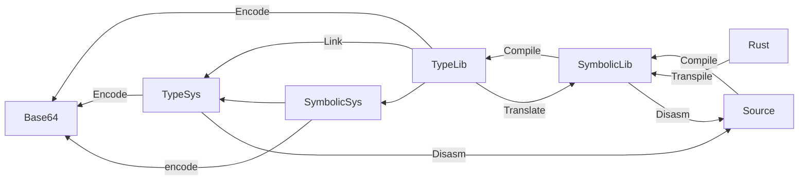

# Workflows

```mermaid
flowchart RL
    Source -- Compile --> SymbolicLib
    Rust -- Transpile --> SymbolicLib
    SymbolicLib -- Compile --> TypeLib
    SymbolicLib -- Disasm --> Source
    TypeLib -- Translate --> SymbolicLib
    TypeLib -- Link --> TypeSys
    TypeLib -- Encode --> Base64
    TypeSys -- Encode --> Base64
    TypeSys -- Disasm --> Source
    TypeLib --> SymbolicSys
    SymbolicSys --> TypeSys
    SymbolicSys -- encode --> Base64
```
