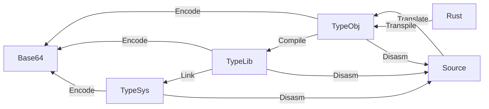

# Workflows

```mermaid
flowchart RL
    Source -- Translate --> TypeObj
    Rust -- Transpile --> TypeObj
    TypeObj -- Compile --> TypeLib
    TypeObj -- Disasm --> Source
    TypeObj -- Encode --> Base64
    TypeLib -- Link --> TypeSys
    TypeLib -- Disasm --> Source
    TypeLib -- Encode --> Base64
    TypeSys -- Encode --> Base64
    TypeSys -- Disasm --> Source
```
